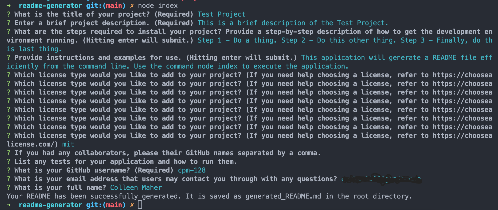
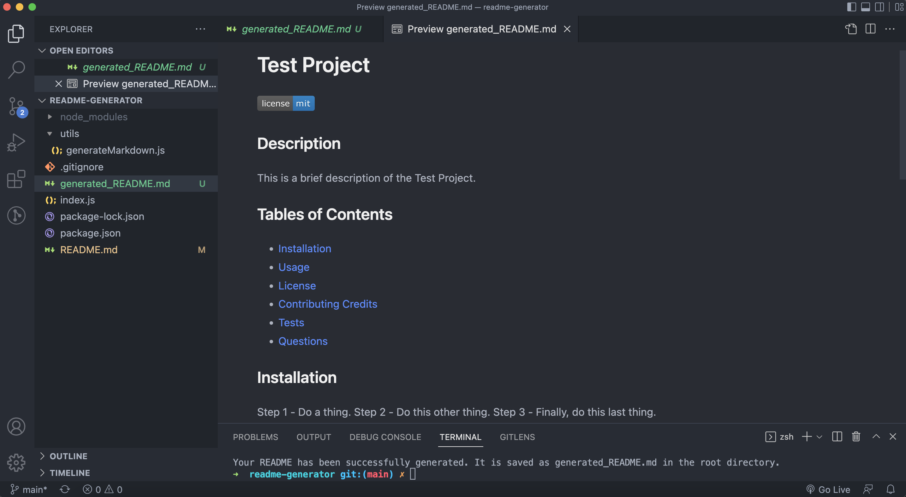

# Professional README Generator
<a href="#license"></img></a>

## Description
A comand-line application that dynamically generates a professional README.md file from a user's input.

### User Story
AS A developer
I WANT a README generator
SO THAT I can quickly create a professional README for a new project

## Table of Contents
- <a href="#acceptance-criteria">Acceptance Criteria</a>
- <a href="#technologies">Technologies</a>
- <a href="#installation">Installation</a>
- <a href="#usage">Usage</a>
- <a href="#deployment">Deployment</a>
- <a href="#credits">Credits</a>
- <a href="#license">License</a>

## Acceptance Criteria
GIVEN a command-line application that accepts user input . . .

WHEN I am prompted for information about my application repository 
THEN a high-quality, professional README.md is generated with:
- the title of my project
- sections entitled:
    - Description
    - Table of Contents
    - Installation
    - Usage
    - License
    - Contributing Credits
    - Tests
    - Questions

WHEN I enter my project title 
THEN this is displayed as the title of the README

WHEN I enter a description, installation instructions, usage information, contribution guidelines, and test instructions 
THEN this information is added to the sections of the README entitled Description, Installation, Usage, Contributing, and Tests

WHEN I choose a license for my application from a list of options 
THEN a badge for that license is added near the top of the README and a notice is added to the section of the README entitled License that explains which license the application is covered under

WHEN I enter my GitHub username 
THEN this is added to the section of the README entitled Questions, with a link to my GitHub profile

WHEN I enter my email address 
THEN this is added to the section of the README entitled Questions, with instructions on how to reach me with additional questions

WHEN I click on the links in the Table of Contents 
THEN I am taken to the corresponding section of the README

## Technologies
- Node.js
- Inquirer package

## Installation
- Clone to repository from GitHub locally.
- Open the repo, in the root directory, in VS Code.
- The application is invoked by using the following command: _node index.js_
## Usage
To quickly generate professional and complete README files for a repository.

## Deployment

### Screencapture
1. Terminal

2. Generated File

### Video Walk Through
<a href="https://drive.google.com/file/d/1hvIpOihKkD4UPbYJUsXNrN3be-A1KiOb/view?usp=sharing">Watch here.</a>

## Credits
<a href="https://github.com/coding-boot-camp/potential-enigma">UNC Coding Bootcamp Starter Code</a>

## License
MIT License

Copyright (c) [2022] [Colleen Maher]

Permission is hereby granted, free of charge, to any person obtaining a copy
of this software and associated documentation files (the "Software"), to deal
in the Software without restriction, including without limitation the rights
to use, copy, modify, merge, publish, distribute, sublicense, and/or sell
copies of the Software, and to permit persons to whom the Software is
furnished to do so, subject to the following conditions:

The above copyright notice and this permission notice shall be included in all
copies or substantial portions of the Software.

THE SOFTWARE IS PROVIDED "AS IS", WITHOUT WARRANTY OF ANY KIND, EXPRESS OR
IMPLIED, INCLUDING BUT NOT LIMITED TO THE WARRANTIES OF MERCHANTABILITY,
FITNESS FOR A PARTICULAR PURPOSE AND NONINFRINGEMENT. IN NO EVENT SHALL THE
AUTHORS OR COPYRIGHT HOLDERS BE LIABLE FOR ANY CLAIM, DAMAGES OR OTHER
LIABILITY, WHETHER IN AN ACTION OF CONTRACT, TORT OR OTHERWISE, ARISING FROM,
OUT OF OR IN CONNECTION WITH THE SOFTWARE OR THE USE OR OTHER DEALINGS IN THE
SOFTWARE.